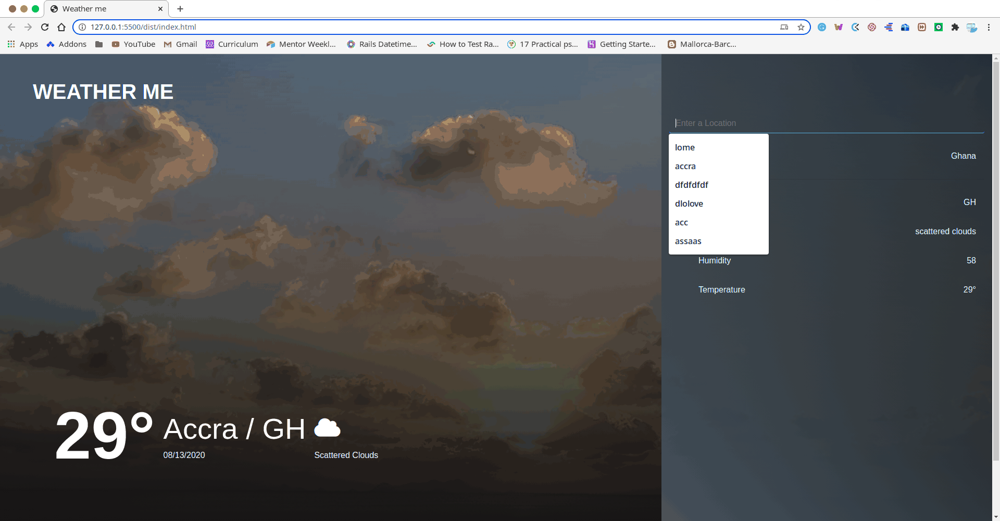

<!--
*** Thanks for checking out this README Template. If you have a suggestion that would
*** make this better, please fork the repo and create a pull request or simply open
*** an issue with the tag "enhancement".
*** Thanks again! Now go create something AMAZING! :D
-->

<!-- PROJECT SHIELDS -->
<!--
*** I'm using markdown "reference style" links for readability.
*** Reference links are enclosed in brackets [ ] instead of parentheses ( ).
*** See the bottom of this document for the declaration of the reference variables
*** for contributors-url, forks-url, etc. This is an optional, concise syntax you may use.
*** https://www.markdownguide.org/basic-syntax/#reference-style-links
-->

 

# Weather-me

> A weather forecast site using the weather API. Created with JavaScript.
Read more on the project specifications on [Odin](https://www.theodinproject.com/courses/javascript/lessons/weather-app)

- Loads weather Content directly to the page using Javascript.
- Loads the weather for Accra when the page loads.
- User can search for a location and the weather is diplayed for the location.
- Displays related search for city
- Responsive

#  Screenshot

# Live Demo
[Live Demo Link](https://heuristic-hopper-7e6e01.netlify.app/)

# Built With

- JavaScript
- Babel
- WebPack
- HTML5
- CSS3

# usage
visit live [link](https://heuristic-hopper-7e6e01.netlify.app/) in your browser.

## Author

👤 **Kelly Booster**

- Github: [@kelibst](https://github.com/kelibst)
- Twitter: [@keli_booster](https://twitter.com/keli_booster)
- Linkedin: [Kekeli (Jiresse) Dogbevi
](https://www.linkedin.com/in/kekeli-dogbevi-jiresse/)

# 🤝 Contributing
Contributions, issues and feature requests are welcome!

Design inspiration from [Arthur K](https://dribbble.com/shots/7118235-Weather-DailyUI-037)

Feel free to check the issues page

# Show your support
Give a ⭐️ if you like this project!

This project is [MIT](lic.url) licensed.